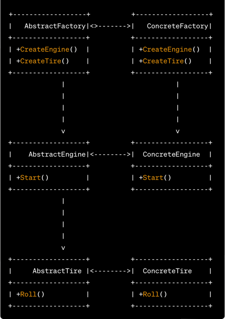
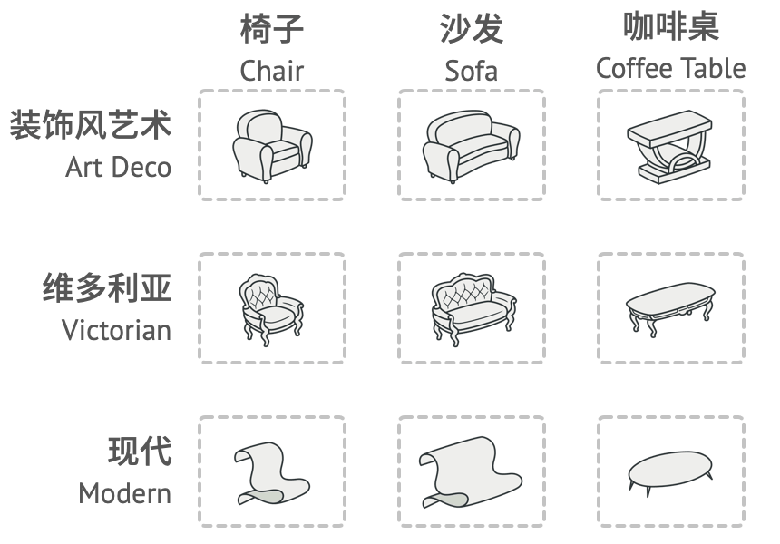

抽象工厂模式是一种创建型设计模式，它提供了一种创建一系列相关或相互依赖对象的接口，而无需指定具体类。抽象工厂模式有以下优点和缺点：

优点：

1.  封装变化：抽象工厂模式将具体产品的创建逻辑封装在具体工厂类中，使得客户端与具体产品的实现解耦。这样，如果需要更换产品族或添加新的产品族，只需要新增具体工厂类，而不需要修改客户端代码。

2.  产品一致性：抽象工厂模式保证了一系列相关产品的一致性。所有由同一具体工厂创建的产品都属于同一产品族，它们之间相互配合使用，能够保证系统的一致性。

3.  符合开闭原则：抽象工厂模式通过添加新的具体工厂类和产品类来扩展系统，而不需要修改已有代码。这符合开闭原则，即对扩展开放，对修改关闭。

缺点：

1.  不易扩展新产品：抽象工厂模式在增加新产品时比较复杂。如果需要添加新的产品，不仅需要新增具体产品类，还需要修改抽象工厂接口及其所有具体工厂的实现。这会导致系统的维护成本增加。

2.  增加了系统复杂度：引入抽象工厂模式会增加系统的类和对象数量，增加了系统的复杂度和理解难度。

使用场景： 抽象工厂模式适用于以下情况：

*   系统需要一系列相互关联或相互依赖的产品对象，而不希望客户端直接依赖具体产品类。
*   系统需要根据不同的条件选择创建不同产品族的对象。
*   需要提供一个产品类库，而只暴露其抽象接口给客户端，隐藏具体实现细节。

总结： 抽象工厂模式通过提供抽象工厂接口和具体工厂类，封装了产品的创建逻辑，并保证了产品一致性。它能够提供灵活的扩展性和可维护性，但同时也增加了系统的复杂度和理解难度。在设计系统时，需要根据具体的业务需求和扩展性考虑是否使用抽象工厂模式。

通过使用抽象工厂模式，我们可以轻松地扩展新的汽车类型工厂和零部件，而不需要修改现有的代码。例如，如果需要新增一个卡车工厂和相应的零部件，只需创建一个新的卡车工厂和卡车引擎、卡车轮胎的具体产品，并实现抽象工厂接口。这样，我们就可以在不改变现有代码的情况下扩展汽车制造业的功能。

