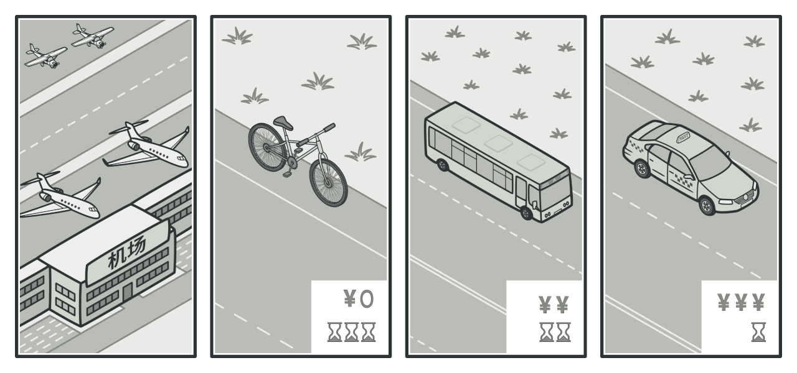

策略模式是一种行为设计模式，它能让你定义一系列算法，并将每种算法分别放入独立的类中，以使算法的对象能够相互替换。

策略模式的优点：
1. 算法的灵活性：策略模式使得算法可以独立于客户端进行修改和扩展，可以动态地切换算法实现，灵活应对不同的需求。
2. 可扩展性：新增一种策略只需要添加相应的策略类，符合开闭原则，不会影响到其他已有的策略。
3. 简化复杂的条件语句：策略模式将各种算法逻辑封装在具体策略类中，避免了大量的条件语句，提高了代码的可读性和可维护性。
4. 提高了代码的复用性：不同的客户端可以共享同一组策略类，减少了重复代码的编写。

策略模式的缺点：
1. 增加了类的数量：引入策略模式会增加策略类的数量，如果策略较多，可能会导致类的数量庞大，不利于代码的维护。
2. 客户端需要了解不同的策略类：客户端需要明确知道每个具体策略类的特点和选择条件，增加了对策略的理解和选择的复杂性。

策略模式适用的场景：
1. 多个类只有在算法或行为上稍有不同的情况。
2. 需要动态切换不同算法的情况。
3. 需要屏蔽具体算法实现，使得算法的变化不会影响到使用算法的客户端。
4. 需要将一组相关的算法封装起来，以便在不同的场景下选择使用。

常见的使用场景包括支付方式选择、排序算法的选择、日志记录方式的选择等。策略模式在需要根据不同条件选择不同算法或行为的场景中能够提供灵活、可扩展的解决方案。

